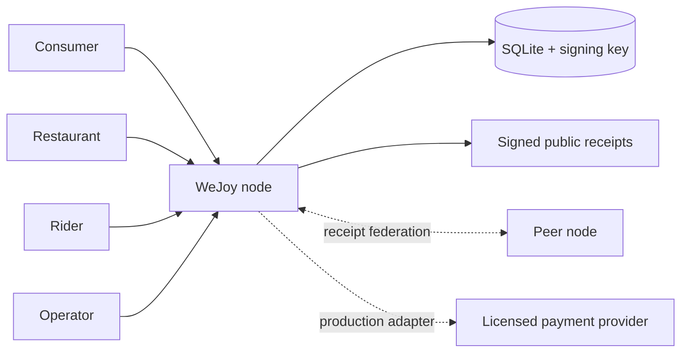
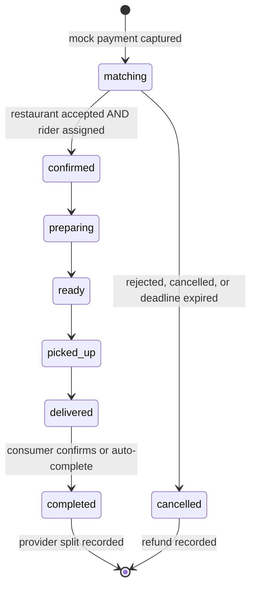

<div align="center">
  <h1>WeJoy</h1>
  <p><strong>A deployable, community-owned food-delivery node.</strong></p>
  <p><strong>English</strong> · <a href="./README.zh-CN.md">简体中文</a></p>
  <p>
    <a href="https://github.com/Underwater008/wejoy/actions/workflows/ci.yml"></a>
    <a href="https://github.com/Underwater008/wejoy/releases/tag/v0.1.0"></a>
    <a href="./LICENSE"></a>
  </p>
</div>

<p align="center">
  
</p>

WeJoy gives consumers, independent restaurants, riders, and community operators one local system for ordering, parallel acceptance, delivery, and transparent accounting. A node serves the responsive web app, API, SQLite database, matching workflow, allocation ledger, and signed public receipts from one container.

> [!WARNING]
> **Payment boundary:** v0.1 uses an immediate **mock payment adapter**. It simulates one consumer payment, refunds, and fund splits, but it does not move real money. Do not use this release for real customer funds. Production requires a licensed payment provider, provider callbacks, reconciliation, identity checks, security hardening, and jurisdiction-specific legal review.

<details>
  <summary><strong>View all four workspaces</strong></summary>
  <br>
  
</details>

## What Works

- **Consumer:** browse menus, build a cart, pay once, track matching, cancel during matching, confirm delivery, and inspect the allocation.
- **Restaurant:** set open/closed state, manage menu items, accept or reject orders, start preparation, and mark food ready.
- **Rider:** set availability and a minimum delivery fee, claim eligible offers, confirm pickup, and confirm delivery.
- **Operator:** monitor orders and disputes, inspect node totals, resolve disputes, view peers, and audit signed order receipts.
- **Matching:** restaurant and rider accept in parallel; only both acceptances confirm the order.
- **Recovery:** unmatched orders expire and refund automatically; delivered orders auto-complete after the configured delay.
- **Federation v0:** nodes verify and replicate paginated, hash-chained Ed25519 receipts without personal data.

## Quick Start

Run the public multi-architecture image from GitHub Container Registry:

```bash
docker run --name wejoy \
  -p 8787:8787 \
  -v wejoy-data:/data \
  -e NODE_NAME="My Community Node" \
  -e NODE_PUBLIC_URL="http://localhost:8787" \
  -e PAYMENT_PROVIDER=mock \
  -e SEED_DEMO_DATA=true \
  ghcr.io/underwater008/wejoy:0.1.0
```

Open [http://localhost:8787](http://localhost:8787). The web client and API share the same port. SQLite data and the node signing key persist in the `wejoy-data` volume.

Docker Compose users can run:

```bash
docker compose up --build
```

To build the image locally:

```bash
docker build -t wejoy .
```

## Demo Accounts

All seeded accounts use password `demo1234`.

| Role | Username |
| --- | --- |
| Consumer | `demo.consumer` |
| Restaurant | `demo.noodles` |
| Restaurant | `demo.dumplings` |
| Rider | `demo.rider` |
| Rider | `demo.rider2` |
| Operator | `demo.operator` |

For a non-demo node, start with a fresh data volume and `SEED_DEMO_DATA=false`. Disabling the seed flag does not remove demo accounts from an existing database.

## Architecture



The MVP is a modular monolith: one deployable process owns the web/API boundary while domain, payments, identity, persistence, and federation remain separate modules. This keeps self-hosting simple without coupling the future payment provider or node protocol to the UI.

## Order Contract



Every order records separate restaurant, rider, and node allocations in integer fen. The restaurant never pays the rider, and the application is not designed to receive funds and manually redistribute them.

## Local Development

Node.js 24 or newer is required.

```bash
npm install
npm run dev
```

The API runs at `http://localhost:8787`; Vite runs at `http://localhost:5173` and proxies API calls. Before opening a pull request:

```bash
npm run check
```

## Configuration

| Variable | Default | Purpose |
| --- | --- | --- |
| `PORT` | `8787` | HTTP port |
| `DATA_DIR` | repo `.data` / container `/data` | SQLite and signing-key directory |
| `NODE_NAME` | `WeJoy Community Node` | Public node name |
| `NODE_PUBLIC_URL` | `http://localhost:8787` | Canonical peer URL |
| `MATCH_WINDOW_SECONDS` | `300` | Parallel acceptance deadline |
| `AUTO_COMPLETE_SECONDS` | `900` | Delay before delivered order auto-completes |
| `DEFAULT_RIDER_FEE_FEN` | `600` | Quote fallback when no rider is online |
| `INFRA_FEE_FEN` | `50` | Per-order node allocation |
| `PAYMENT_PROVIDER` | `mock` | Payment adapter; v0.1 supports only `mock` |
| `ALLOW_REGISTRATION` | `true` | Public account registration |
| `SEED_DEMO_DATA` | `true` | Seed demo accounts on an empty database |
| `WEJOY_PEERS` | empty | Comma-separated peer URLs |

See [.env.example](.env.example) for a copyable configuration.

## Repository

```text
apps/node       Fastify API, SQLite, auth, matching, payments, federation
apps/web        React role workspaces served by the node
packages/domain Shared money and order-state invariants
docs            Product, architecture, payment, API, and operations docs
```

- [Product contract](docs/PRODUCT.md)
- [Architecture](docs/ARCHITECTURE.md)
- [Payment and compliance boundary](docs/PAYMENTS-COMPLIANCE.md)
- [Operations guide](docs/OPERATIONS.md)
- [HTTP API](docs/API.md)
- [Security policy](SECURITY.md)
- [Contributing](CONTRIBUTING.md)

## License

WeJoy is licensed under [AGPL-3.0-only](LICENSE). Network operators who modify the program must make the corresponding source available under the license terms.
