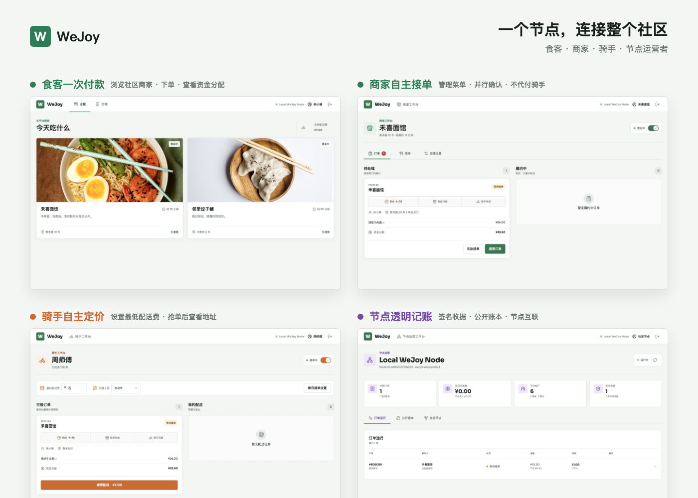
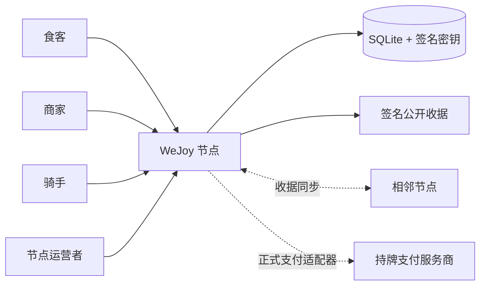
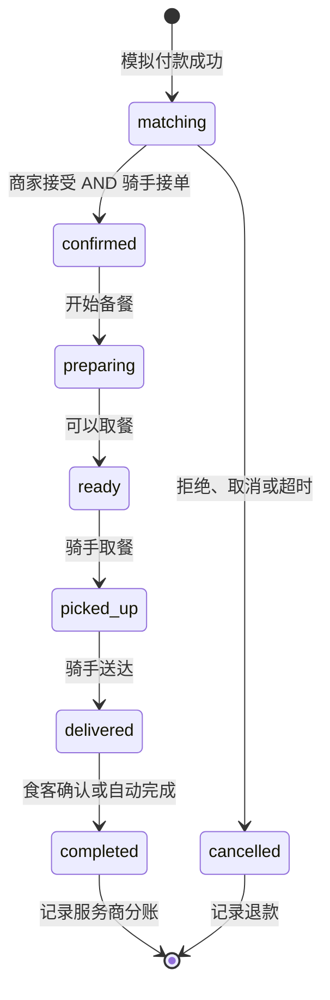

<div align="center">
  <h1>WeJoy</h1>
  <p><strong>可独立部署、由社区共同拥有的外卖配送节点。</strong></p>
  <p><a href="./README.md">English</a> · <strong>简体中文</strong></p>
  <p>
    <a href="https://github.com/Underwater008/wejoy/actions/workflows/ci.yml"></a>
    <a href="https://github.com/Underwater008/wejoy/releases/tag/v0.1.0"></a>
    <a href="./LICENSE"></a>
  </p>
</div>

<p align="center">
  
</p>

WeJoy 让食客、独立餐厅、骑手和社区运营者在同一个本地系统中完成点餐、并行接单、配送和透明记账。一个容器即可运行响应式网页、API、SQLite 数据库、订单匹配、资金分配账本和带签名的公开收据。

> [!WARNING]
> **支付边界：**v0.1 使用即时返回的**模拟支付适配器**。它会模拟食客一次付款、退款和分账记录，但不会转移真实资金。请勿用此版本处理真实顾客资金。正式上线需要接入持牌支付服务商，并完成支付回调、对账、身份验证、安全加固和当地法律合规审查。

<details>
  <summary><strong>查看四类用户工作台</strong></summary>
  <br>
  
</details>

## 已实现功能

- **食客：**浏览菜单、加入购物车、一次付款、查看匹配状态、匹配阶段取消、确认收货并查看资金分配。
- **商家：**切换营业状态、管理菜单、接受或拒绝订单、开始备餐并标记出餐。
- **骑手：**设置接单状态和最低配送费、领取符合条件的订单、确认取餐和送达。
- **节点运营者：**监控订单与争议、查看节点统计、处理争议、管理相邻节点并审计签名收据。
- **并行匹配：**商家和骑手可以先后独立接单；双方都确认后订单才正式成立。
- **自动恢复：**超时未匹配的订单自动取消并退款；送达后超过设定时间自动完成。
- **节点互联 v0：**节点之间分页同步经过 Ed25519 签名、哈希串联且不含个人信息的公开收据。

## 快速部署

直接运行 GitHub Container Registry 中公开的多架构镜像：

```bash
docker run --name wejoy \
  -p 8787:8787 \
  -v wejoy-data:/data \
  -e NODE_NAME="我的社区节点" \
  -e NODE_PUBLIC_URL="http://localhost:8787" \
  -e PAYMENT_PROVIDER=mock \
  -e SEED_DEMO_DATA=true \
  ghcr.io/underwater008/wejoy:0.1.0
```

打开 [http://localhost:8787](http://localhost:8787)。网页和 API 使用同一个端口，SQLite 数据与节点签名密钥会保存在 `wejoy-data` 数据卷中。

使用 Docker Compose：

```bash
docker compose up --build
```

也可以在本地构建镜像：

```bash
docker build -t wejoy .
```

## 演示账户

所有预置账户的密码都是 `demo1234`。

| 身份 | 用户名 |
| --- | --- |
| 食客 | `demo.consumer` |
| 商家 | `demo.noodles` |
| 商家 | `demo.dumplings` |
| 骑手 | `demo.rider` |
| 骑手 | `demo.rider2` |
| 节点运营者 | `demo.operator` |

部署非演示节点时，请使用新的数据卷并设置 `SEED_DEMO_DATA=false`。关闭该选项不会删除已有数据库中的演示账户。

## 系统架构



MVP 采用模块化单体架构：一个部署进程负责网页和 API，领域逻辑、支付、身份、存储和节点互联分别保留清晰模块边界。这样既能降低自建节点的运维成本，也不会把未来的支付服务商或节点协议绑定在前端界面上。

## 订单规则



每笔订单都以整数分为单位，分别记录商家、骑手和节点应得金额。商家不负责给骑手付款，应用也不应先收取资金再由节点人工分发。

## 本地开发

需要 Node.js 24 或更高版本。

```bash
npm install
npm run dev
```

API 运行在 `http://localhost:8787`；Vite 运行在 `http://localhost:5173` 并代理 API 请求。提交代码前运行：

```bash
npm run check
```

## 配置项

| 环境变量 | 默认值 | 用途 |
| --- | --- | --- |
| `PORT` | `8787` | HTTP 端口 |
| `DATA_DIR` | 仓库 `.data` / 容器 `/data` | SQLite 数据库和签名密钥目录 |
| `NODE_NAME` | `WeJoy Community Node` | 对外显示的节点名称 |
| `NODE_PUBLIC_URL` | `http://localhost:8787` | 节点标准访问地址 |
| `MATCH_WINDOW_SECONDS` | `300` | 商家与骑手并行接单时限 |
| `AUTO_COMPLETE_SECONDS` | `900` | 送达后自动完成的等待时间 |
| `DEFAULT_RIDER_FEE_FEN` | `600` | 没有在线骑手时的配送费报价 |
| `INFRA_FEE_FEN` | `50` | 每笔订单分配给节点的基础设施费用 |
| `PAYMENT_PROVIDER` | `mock` | 支付适配器；v0.1 只支持 `mock` |
| `ALLOW_REGISTRATION` | `true` | 是否允许公开注册 |
| `SEED_DEMO_DATA` | `true` | 是否在空数据库中创建演示账户和数据 |
| `WEJOY_PEERS` | 空 | 以逗号分隔的相邻节点地址 |

可以复制 [.env.example](.env.example) 后修改配置。

## 仓库结构

```text
apps/node       Fastify API、SQLite、身份验证、匹配、支付和节点互联
apps/web        由节点直接提供的 React 多角色工作台
packages/domain 资金与订单状态的共享领域规则
docs            产品、架构、支付、API 与运维文档
```

- [产品规则](docs/PRODUCT.md)
- [系统架构](docs/ARCHITECTURE.md)
- [支付与合规边界](docs/PAYMENTS-COMPLIANCE.md)
- [运维指南](docs/OPERATIONS.md)
- [HTTP API](docs/API.md)
- [安全策略](SECURITY.md)
- [参与贡献](CONTRIBUTING.md)

## 开源协议

WeJoy 使用 [AGPL-3.0-only](LICENSE) 协议。通过网络运行修改版程序的节点运营者，需要按照该协议向用户提供对应源代码。
