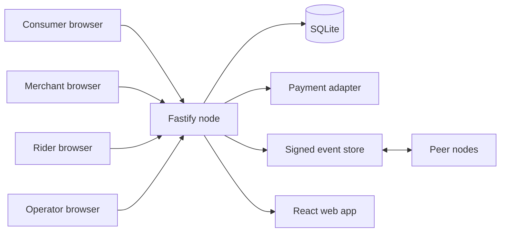
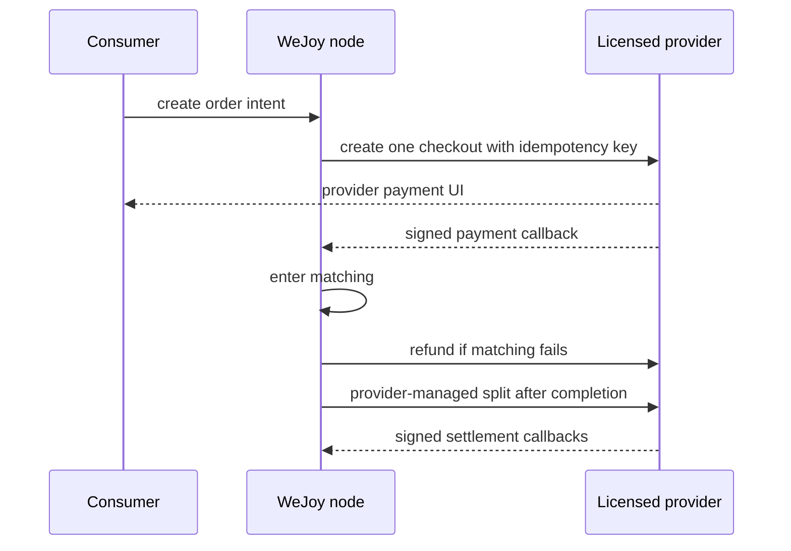

# Architecture

## Deployment Unit

WeJoy v0.1 is a modular monolith. One container serves the web client, API, local SQLite database, maintenance worker, node identity, and federation client.



This keeps a pilot install to one persistent volume and one HTTP port. The code boundaries are designed to separate before scale requires separate services.

## Modules

| Module | Responsibility |
| --- | --- |
| `@wejoy/domain` | statuses, transitions, money allocation, matching resolution |
| `AuthService` | local accounts, scrypt password hashes, bearer sessions |
| `OrderService` | quotes, order commands, role authorization, timeout/refund recovery |
| `PaymentAdapter` | idempotent capture, refund, and split interface |
| `EventStore` | append-only public projection, SHA-256 chain, Ed25519 signature |
| `FederationService` | peer identity pinning, signature/chain validation, cursor sync |
| React client | role-specific commands and live views; no business-state authority |

The server enforces every lifecycle transition. UI controls are convenience, not authorization.

## Transaction Boundaries

- SQLite uses WAL, foreign keys, a busy timeout, and `BEGIN IMMEDIATE` for competing claims.
- Rider assignment uses a conditional update on `status='matching' AND rider_id IS NULL`.
- Merchant/rider acceptance and confirmation are committed with their signed events.
- Payment calls use deterministic idempotency keys and are journaled in `payment_operations`.
- The maintenance worker retries cancelled paid orders and delivered orders awaiting completion.

The mock adapter is synchronous and deterministic. Before adding a remote provider, payment commands must move to a durable outbox with webhook inbox deduplication and reconciliation. The current adapter boundary avoids changing order commands or clients when that is added.

## Payment Upgrade



Required additions for that adapter:

- `payment_intents`, provider webhook inbox, durable outbox, and reconciliation cursor
- Provider account bindings for merchant, rider, and node recipients
- Signature verification, callback replay protection, and provider state as settlement authority
- Partial refund and post-split refund policy
- Operational queues for unknown, delayed, or rejected provider results

The application must never emulate splitting by collecting money into its own ordinary account and manually sending payouts.

## Federation v0

Each order has an independent event chain:

```text
hash = SHA256(orderId, sequence, type, actorRole, publicPayload,
              createdAt, previousHash, nodePublicKey)
signature = Ed25519.sign(hash, nodePrivateKey)
```

Peers pin the public key for a URL. A changed key stops synchronization for operator review. Sync uses an opaque cursor and verifies the event signature, sequence, previous hash, order ID, and key before insertion.

Federation does not make a node Byzantine-fault tolerant. A node can sign false claims about its own orders. Receipts make tampering and inconsistent history detectable; governance and independent provider reconciliation are still required.

## Data Boundaries

Local-only tables contain users, sessions, merchant/rider profiles, menus, orders, exact delivery details, and payment references. Only the public event projection leaves the node.

The signing private key and SQLite database live under `DATA_DIR`. They must be backed up together. Restoring the database without the matching key changes node identity and breaks peer trust.

## Scaling Path

1. Keep the modular monolith for the first real pilot.
2. Add provider webhooks/outbox and production observability before real money.
3. Replace local sessions with a reviewed identity service if multiple nodes share identity.
4. Move command storage to PostgreSQL when write concurrency or high availability requires it.
5. Extract worker processes only after durable queues exist.
6. Add cross-node discovery and ordering as a new protocol, not as an extension of receipt replication.

Repository interfaces should remain, but the SQLite-specific repository work should be isolated before the PostgreSQL step.

## Known Limits

- Node.js currently emits an experimental warning for its built-in SQLite module.
- Schema migration support is intentionally minimal for v0.1.
- Sessions are bearer tokens stored in browser local storage.
- No rate limiting, bot defense, SMS verification, or account recovery is included.
- A single process is not highly available.

These limits are acceptable for a controlled mock-payment pilot, not for a public real-money service.
